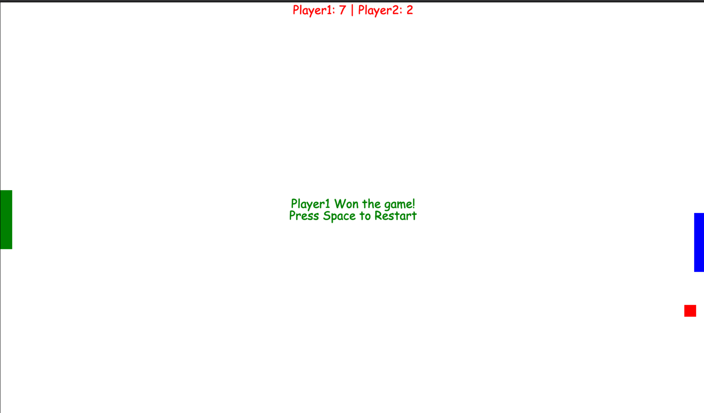
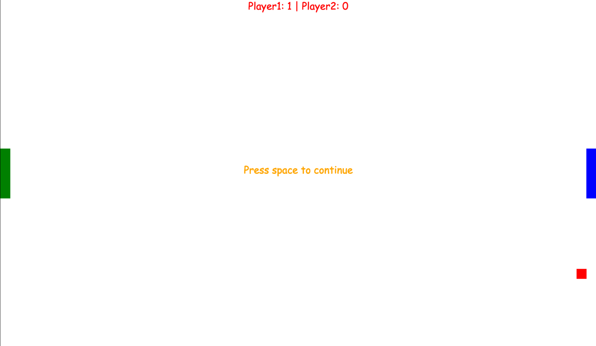

# ping Pong Plain JS
A ping pong game in pure JS

# Steps to Play
Clone the Repo
open index.html in latest browser

# Controls
Player1: Keys `w` and `s`
Player2: `Up` and `Down` Arrow keys
`space` to pause or restart the game

# Future Scope

# Images

